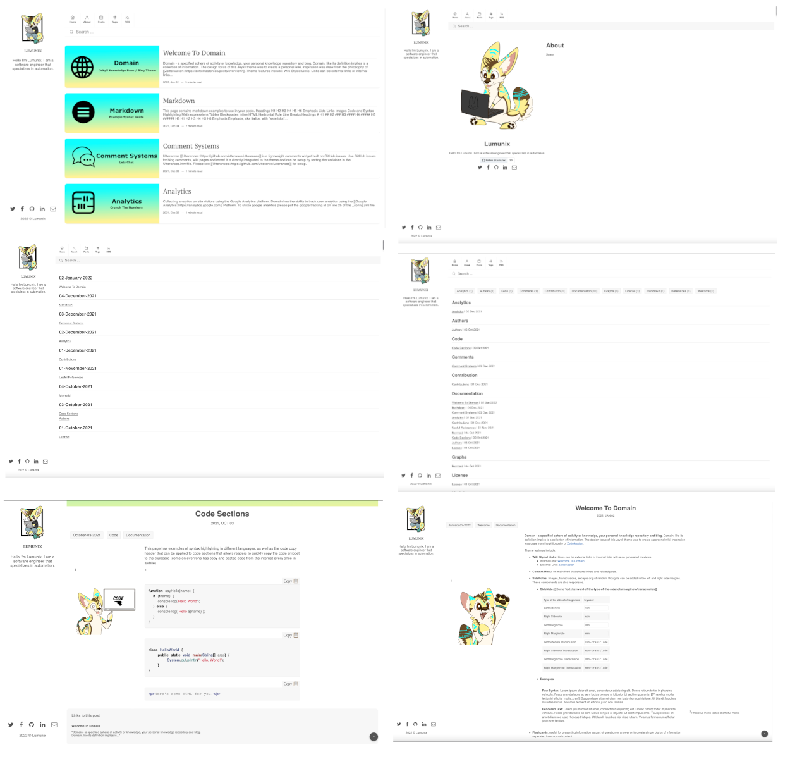

[](https://github.com/Lumunix/Domain/blob/main/LICENSE)
[](https://jekyllrb.com/)
[](https://rubygems.org/gems/domain-jekyll)
[](https://www.paypal.me/Lumunix)


# [Domain](https://lumunix.github.io/Domain/)
Jekyll Knowledge Base / Blog Theme that provides wiki style linking, full text search and automatically generated post organization pages.





## Installation

- Option 1: Use the [Domain Github Pages Initializer](https://github.com/Lumunix/Domain-Github-Pages-Initializer)
- Option 2: Setup as a [gem-based theme](https://jekyllrb.com/docs/themes/#understanding-gem-based-themes)
- Option 3: Setup as a [remote theme](https://blog.github.com/2017-11-29-use-any-theme-with-github-pages/)
- Option 4: Forking/directly copying all of the theme files into your project.


### Gem-based method

With Gem-based themes, directories such as the `assets`, `_layouts`, `_includes`, and `_sass` are stored in the theme’s gem, hidden from your immediate view. Yet all of the necessary directories will be read and processed during Jekyll’s build process.

This allows for easier installation and updating as you don't have to manage any of the theme files. To install:

1. Add the following to your `Gemfile`:

   ```ruby
   gem "domain-jekyll"
   ```

2. Fetch and update bundled gems by running the following [Bundler](http://bundler.io/) command:

   ```bash
   bundle
   ```

3. Set the `theme` in your project's Jekyll `_config.yml` file:

   ```yaml
   theme: domain-jekyll
   ```

To update the theme run `bundle update`.

### Remote theme method

Remote themes are similar to Gem-based themes, but do not require `Gemfile` changes or whitelisting making them ideal for sites hosted with GitHub Pages.

To install:

1. Create/replace the contents of your `Gemfile` with the following:

   ```ruby
   source "https://rubygems.org"

   gem "github-pages", group: :jekyll_plugins
   ```


3. Fetch and update bundled gems by running the following [Bundler](http://bundler.io/) command:

   ```bash
   bundle
   ```

4. Add `remote_theme: "Lumunix/Domain"` to your `_config.yml` file. Remove any other `theme:` or `remote_theme:` entry.


## Usage

For detailed instructions on how to configure, customize, read the [theme's documentation](https://lumunix.github.io/Domain/).

## Development Environment
Included in the repository is a [docker-compose](./docker-compose.yml) file that creates a container from the the official [Jekyll Docker Image](https://hub.docker.com/r/jekyll/jekyll/). This will allow you to setup a development environment without having to install Ruby and Jekyll manually and allow you to quickly test and preview changes.


1. Fork this repo. Clone it to your machine.

2. [Install Docker/Compose](https://docs.docker.com/compose/install/). You must have Docker and Compose installed.

3. In the directory you downloaded the project, open terminal and run the following command `docker compose up`.

4. You should now be able to go to your web browser and view the site [Here](http://127.0.0.1:4000/)
